<!--

  
  

-->

# Overview
　Perlで作成したツール群です。  
　主に環境運用の容易化を目的としています。  

## ツール名  
| Item  | Description | Usage or screen display |  
|:--|:--|:--|  
| [ansi_print](./source/ansi_print) | ANSI_Color文字列出力ルーチン | [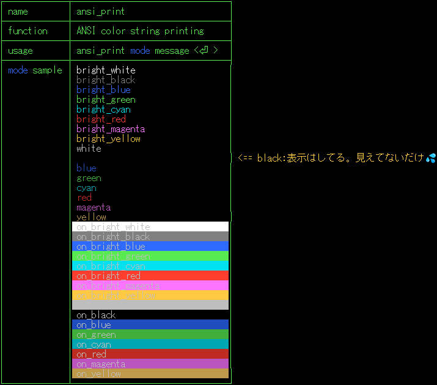](./assets/prtsc/M_ansi_print.png) |  
| [bin2dec.pl](./source/bin2dec.pl) | 2進数 => 10進数変換Tool | [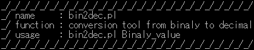](./assets/prtsc/M_bin2dec.png) |  
| [dec2bin.pl](./source/dec2bin.pl) | 10進数 => 2進数変換Tool | [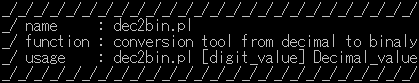](./assets/prtsc/M_dec2bin.png) |  
| [exrm.pl](./source/exrm.pl) | 排他的 File/Dir 削除Tool | [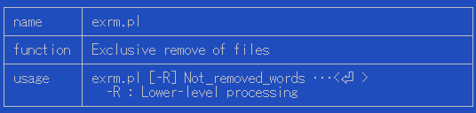](./assets/prtsc/M_exrm.png) |  
| [ffmpeg_asp.pl](./source/ffmpeg_asp.pl) | MP4 aspect比変換コマンド (16:9only) | [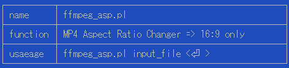](./assets/prtsc/M_ffmpeg_asp.png) |  
| [ffmpeg_cut.pl](./source/ffmpeg_cut.pl) | MP4 先頭削除コマンド | [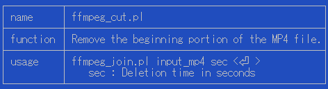](./assets/prtsc/M_ffmpeg_cut.png) |  
| [ffmpeg_merge.pl](./source/ffmpeg_merge.pl) | MP4 結合コマンド | [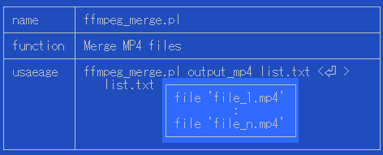](./assets/prtsc/M_ffmpeg_merge.png) |  
| [ffmpeg_split.pl](./source/ffmpeg_split.pl) | MP4 分割コマンド (秒指定) | [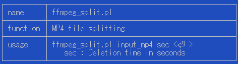](./assets/prtsc/M_ffmpeg_split.png) |  
| [ffmpeg_thumb.pl](./source/ffmpeg_thumb.pl) | MP4 サムネール付加コマンド | [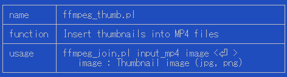](./assets/prtsc/M_ffmpeg_thumb.png) |  
| [ffmpeg_vol.pl](./source/ffmpeg_vol.pl) | MP4 音量変更Tool | [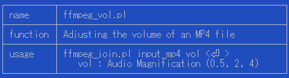](./assets/prtsc/M_ffmpeg_vol.png) |  
| [hashgc.pl](./source/hashgc.pl) | Hash値算出Tool(sha256 only) |  |  
| [prompt_print](./source/prompt_print) | LinuxPrompt偽装出力ルーチン |  |  
| [renm.pl](./source/renm.pl) | File/Dir一括変名ツール(正規表現対応) | [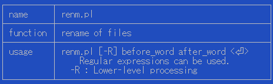](./assets/prtsc/M_renm.png) |  
| [sccheck](./source/sccheck) | 特殊文字検出ルーチン | [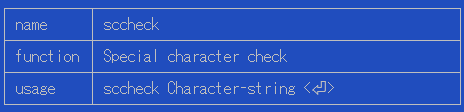](./assets/prtsc/M_sccheck.png) |  
| [unused_assets.pl](./source/unused_assets.pl) | .md未使用ファイル削除 | [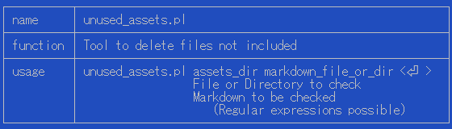](./assets/prtsc/M_unused_assets.png) |  
| [uzfl.pl](./source/uzfl.pl) | ZIP file 展張Tool(一括、No付加) | [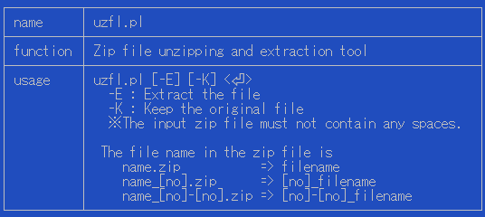](./assets/prtsc/M_uzfl.png) |  

> [!caution]  
> コマンドラインツールです。GUIを面倒くさがる方向けです。  
> WSL又はLinux、Mac(Terminal)上で実行して下さい。  
>  これらを使おうとする人には常識かも知れませんが…  
> 　 危険な動作をするツールがあります。  
> 　 問答無用で実行します。  
> 　 自己責任でお願いします。  
> 引数無しで実行すると**Usage**が表示されるかも知れません。  
> ffmpegは全て"-hide_banner"オプションを指定しています。  
> 拡張子無しの  もPerlスクリプトです。  
>  他のスクリプトから呼ばれているので、利用時には  しておいて下さい。  
>   

## GUI version  
　各ツールのGUIバージョンはTOPページから参照できます。  
　[  AHazeyama/public](https://github.com/AHazeyama/public)  

## License  
　TBD  